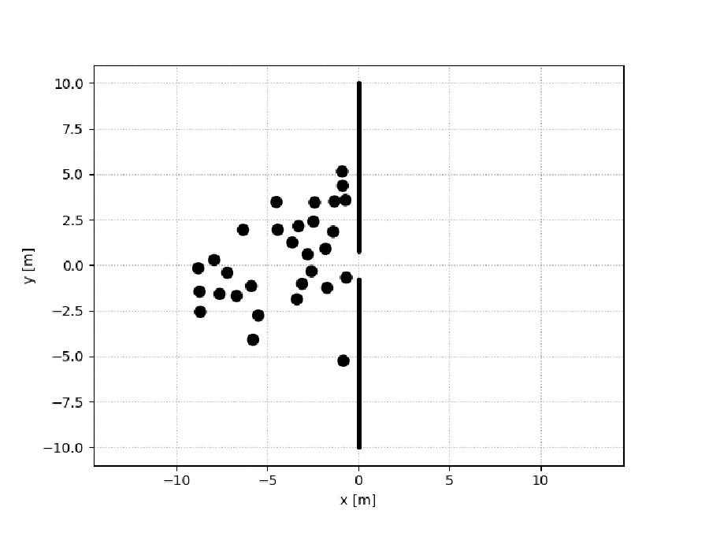
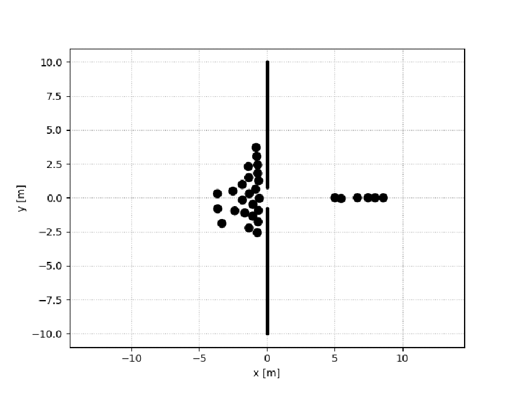
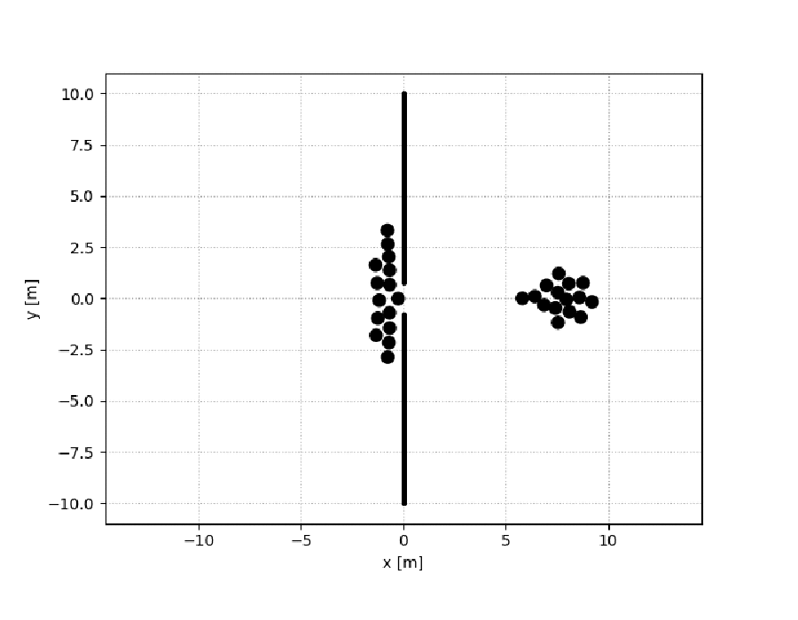
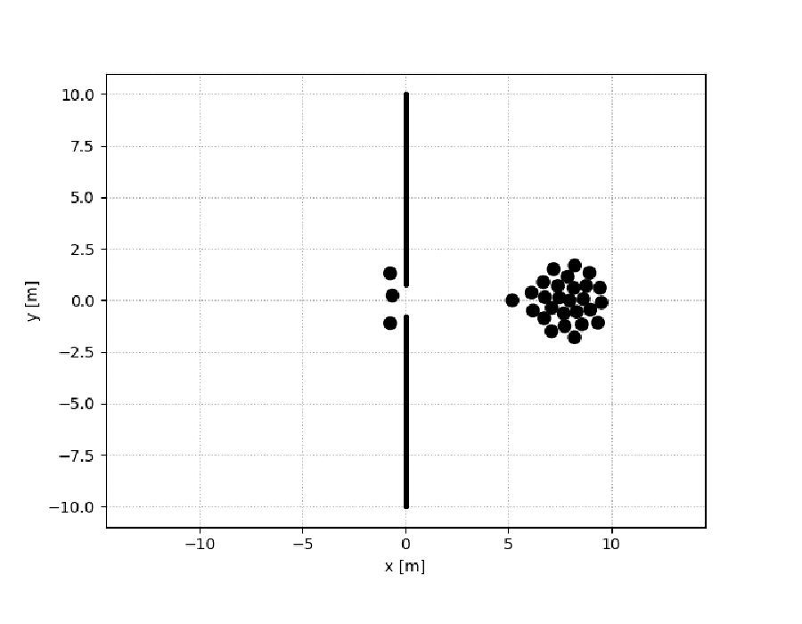
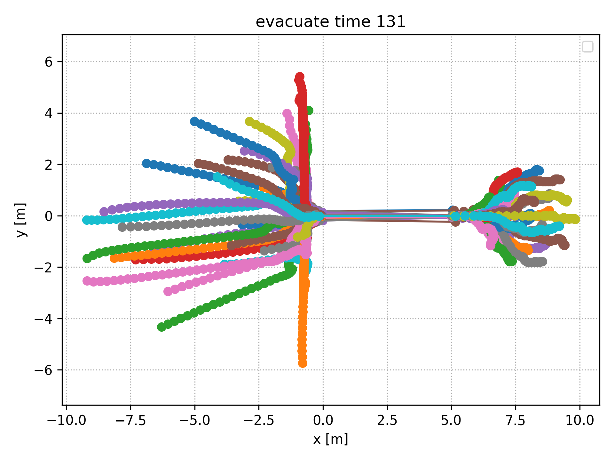
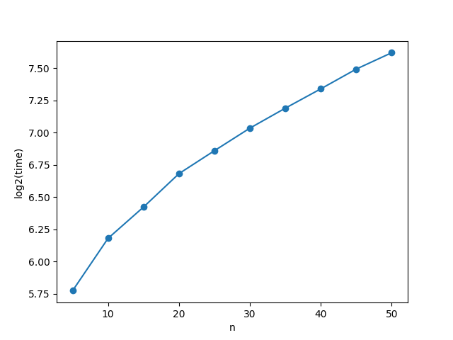
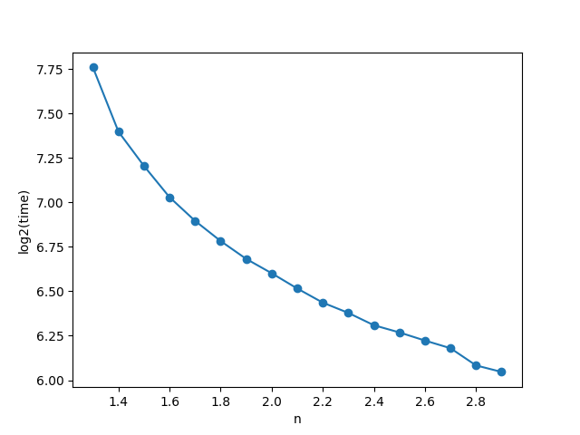
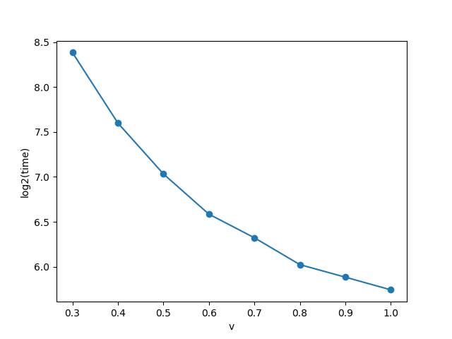

# 																实验报告

​													内容（名称）：行人模型实验报告

| 院（系）名称 | 计算机学院       |
| ------------ | ---------------- |
| 专业名称     | 计算机科学与技术 |
| 指导老师     | 宋晓             |
| 学号         | 17373318         |
| 姓名         | 刘子航           |

2019年11月

## 实验目的

应用社会力模型，对在危机情况或者退场等大人流情况下的人群疏散过程。熟悉行人模型及其仿真过程。

 

## 数学模型

### 模型背景

人群在慌乱中的潮水般的移动，是人类群体行为中最为危险的一种。在火灾，楼房倒塌或者是大型集会散场时常常发生这样的情况，尤其在大型集会越来越频繁的当下。为了更好地系统性地研究这样的具有潜在危险性的行为，我们使用行人在慌乱和阻塞的情况下的模型来研究在这样的情况下，如何去找到一个可行的策略来疏散人群。另外，我们可以找到一个有效的方法，来指导人们从一个布满烟雾视野受阻的房间中撤离。

### 模型公式

论文提出，在社会力模型中，人与人的相互作用力服从下列表达式：

$f_{ij}=\begin{cases}[A_i exp(\frac{r_{ij}-d_{ij}}{B_i})+kg(r_{ij}-d_{ij})]n_{ij}+\kappa g(r_{ij}-d_{ij})\Delta v_{ij}^t t_{ij},d_{ij}<r_{ij}\\0,else\end{cases}$

当$d_{ij}<r_{ij}$时，人与人之间存在着“心理”上的排斥力和物理上的挤压与摩擦。其中：

* $r_{ij}$表示两个行人$i$和$j$的半径之和，即$r_{ij}=r_i+r_j$

* $d_{ij}$表示两个行人$i$和$j$的质心距离

* $A_i$和$B_i$是分别是一个人为了保持正常的前进速度，必须要提供的前进动力和与旁边的人的保持的最小间隙

* 故$r_{ij}-d_{ij}$可以表示为两个人互相推挤的程度，值越大说明两个人之间的挤压越严重

* 故$A_i exp(\frac{r_{ij}-d_{ij}}{B_i})$可以理解为主观心理上的作用力大小，方向为两个人质心连线

* $kg(r_{ij}-d_{ij})$可以理解为两个人身体上互相推搡的力大小，方向为两个人质心连线

* $\kappa g(r_{ij}-d_{ij})\Delta v_{ij}^t$是两个人由于身体挤压和速度不同步产生的摩擦力大小，方向为两个人质心切线

这里我们取$n_{ij}$为两个人质心连线的单位向量，取$t_{ij}$为两个人质心切线方向的单位向量，故人与人之间存在着“心理”上的排斥力可以表示为$A_i exp(\frac{r_{ij}-d_{ij}}{B_i})n_{ij}$，物理上的挤压可以表示为$kg(r_{ij}-d_{ij})n_{ij}$，物理上的摩擦可以表示为$\kappa g(r_{ij}-d_{ij})\Delta v_{ij}^t t_{ij}$，故有上式。


论文提出，在社会力模型中，人与墙的相互作用力服从下列表达式：

$f_{ij}=\{A_i exp(\frac{r_{i}-d_{iW}}{B_i})+kg(r_{i}-d_{iW})\}n_{iW}-\kappa g(r_{i}-d_{iW})(v_i\cdot t_{iW})t_{iW}$

当$d_{iW}<r_{i}$时，人与墙之间存在着“心理”上的排斥力和物理上的挤压与摩擦。该式的力的组成与前一个“人与人”的表达式中各力的组成类型类似，但是存在着细微不同：

* 由于无需考虑墙的半径，且墙是刚体，前式中$r_{ij}$变为$r_i$，意为人的半径

* $d_{iW}$为人的质心与墙$W$的垂直距离

* $n_{iW}$为人的质心与墙$W$的垂直方向的单位向量

* 考虑到墙$W$的摩擦必定是阻力，这里采用了减号

其他同理。

### 模型问题

该初始模型有如下几个问题：

1. 模型中人与人之间的相互作用力只受距离影响，且不同人之间的安全距离相同。而在现实生活中，人与人之间的相互作用力其实受各种各样的因素影响，比如体味、着装或者行李。人与人之间的距离也因人而异，亲密的人之间的距离会相对比较近。

2. 行人的期望速度方向简单地设置为出口方向。而在现实中，亲密的人更加倾向于靠近彼此给予帮助，那此时两人的期望目标是彼此而并不是出口方向。另外如果在行人和出口之间存在着一定的阻碍物，那么此时行人的首要目标是绕行而不是穿行。

3. 没有为行人设置视野，同时没有考虑行人之间的相对方向。模型将每个行人简单的抽象成一个圆形，这是极限的简化。在实际情况中，行人背对背时，相互的“心理”作用里和物理作用力都几乎可以理解为零，因为他们既看不到对方又相背而行。同样，处在危机情况中的行人是没有“上帝视角”的，他们可能既不知道出口再哪里也不知道前方有没有障碍物，那么他们可能倾向于跟着人流前行或者跟着某个特殊的领导者前进。而在实际情况中，我们也经常会遇到由于不认识路而随着大众盲目前行或者跟着“导游”的前进的情况。

4. 模型没有考虑到行人可以通过调整速度和方向来避免碰撞。由于实际中行人并不是盲目前进的，他们很有可能为了避免碰撞而主动地调整自己的前进速度和方向，来避免局部的碰撞和挤压。

为了更好地模拟，对于模型可以有以下几种修正（优化办法按照序号对应上述问题）：

1. 将模型中的$r_{i}$项，即每个人的半径，予以一定的随机化，比如采用泊松分布来随机生成每个人的半径。
2. 采用一定的路径规划算法，通过判断墙壁的位置，来取得一个人绕过障碍物逃出房间的路线。再进一步，我们可以在路径规划中不仅仅考虑墙的阻碍，也同时考虑其他行人的阻碍，这样可以让行人找到一个可以“插空”的路线，绕开人群密集的地方，从人群稀疏的地方离开房间。
3. 首先为行人设置一个“视野”，取值即为指向当前前进方向的一个扇形。若有一个出口在视野内，行人可以有效地感知到并且前进；而如果出口在视野范围外，我们可以将行人下一时刻的前进方向改为该扇形中所有人方向的矢量和（即模拟“随大流”这样一种社会心理）
4. 同第一项


## 编程实现

### 核心代码

+ 核心代码部分fork自svenkreiss的socialforce仓库

在处理上，将墙看作是不可移动的，质量极大的，没有目的的“人”，并参与到与真人的碰撞和挤压的计算中去。

`PedPedPotential类`（人和人之间）和`PedSpacePotential类`（人和墙之间）通过社会力的方程计算出每个人在$\Delta t=0.4s$时间内的加速度。Simulator类使用上述两个类，在得到每个人加速度的基础上，计算每个人的速度和位置的变化并推进时间，最后得到受到包括社会心态影响和物理力影响的每个人的行动。

每次调用`step()`方法都会推进一个$\Delta t$的时间，并且重新计算一次所有人的行动情况。

```python
class Simulator(object):
    def __init__(self, initial_state, ped_space=None, delta_t=0.4, tau=0.5):
        self.state = initial_state
        self.initial_speeds = stateutils.speeds(initial_state)
        self.max_speeds = MAX_SPEED_MULTIPLIER * self.initial_speeds
        self.delta_t = delta_t
        if self.state.shape[1] < 7:
            if not hasattr(tau, 'shape'):
                tau = tau * np.ones(self.state.shape[0])
            self.state = np.concatenate((self.state, np.expand_dims(tau, -1)), axis=-1)
        # potentials
        self.V = PedPedPotential(self.delta_t)
        self.U = ped_space
        # field of view
        self.w = FieldOfView()
    def f_ab(self):
        """Compute f_ab."""
        return -1.0 * self.V.grad_r_ab(self.state)
    def f_aB(self):
        """Compute f_aB."""
        if self.U is None:
            return np.zeros((self.state.shape[0], 0, 2))
        return -1.0 * self.U.grad_r_aB(self.state)
    def capped_velocity(self, desired_velocity):
        """Scale down a desired velocity to its capped speed."""
        desired_speeds = np.linalg.norm(desired_velocity, axis=-1)
        factor = np.minimum(1.0, self.max_speeds / desired_speeds)
        return desired_velocity * np.expand_dims(factor, -1)
    def step(self):
        """Do one step in the simulation and update the state in place."""
        # accelerate to desired velocity
        e = stateutils.desired_directions(self.state)
        vel = self.state[:, 2:4]
        tau = self.state[:, 6:7]
        F0 = 1.0 / tau * (np.expand_dims(self.initial_speeds, -1) * e - vel)
        # repulsive terms between pedestrians
        f_ab = self.f_ab()
        w = np.expand_dims(self.w(e, -f_ab), -1)
        F_ab = w * f_ab
        # repulsive terms between pedestrians and boundaries
        F_aB = self.f_aB()
        # social force
        F = F0 + np.sum(F_ab, axis=1) + np.sum(F_aB, axis=1)
        # desired velocity
        w = self.state[:, 2:4] + self.delta_t * F
        # velocity
        v = self.capped_velocity(w)
        # update state
        self.state[:, 0:2] += v * self.delta_t
        self.state[:, 2:4] = v
        return self
```

```python
class PedPedPotential(object):
    def __init__(self, delta_t, v0=2.1, sigma=0.3):
        self.delta_t = delta_t
        self.v0 = v0
        self.sigma = sigma
    def b(self, r_ab, speeds, desired_directions):
        speeds_b = np.expand_dims(speeds, axis=0)
        speeds_b_abc = np.expand_dims(speeds_b, axis=2)  # abc = alpha, beta, coordinates
        e_b = np.expand_dims(desired_directions, axis=0)
        in_sqrt = (
            np.linalg.norm(r_ab, axis=-1) +
            np.linalg.norm(r_ab - self.delta_t * speeds_b_abc * e_b, axis=-1)
        )**2 - (self.delta_t * speeds_b)**2
        np.fill_diagonal(in_sqrt, 0.0)
        return 0.5 * np.sqrt(in_sqrt)
    def value_r_ab(self, r_ab, speeds, desired_directions):
        return self.v0 * np.exp(-self.b(r_ab, speeds, desired_directions) / self.sigma)
    @staticmethod
    def r_ab(state):
        r = state[:, 0:2]
        r_a = np.expand_dims(r, 1)
        r_b = np.expand_dims(r, 0)
        return r_a - r_b
    def __call__(self, state):
        speeds = stateutils.speeds(state)
        return self.value_r_ab(self.r_ab(state), speeds, stateutils.desired_directions(state))
    def grad_r_ab(self, state, delta=1e-3):
        r_ab = self.r_ab(state)
        speeds = stateutils.speeds(state)
        desired_directions = stateutils.desired_directions(state)
        dx = np.array([[[delta, 0.0]]])
        dy = np.array([[[0.0, delta]]])
        v = self.value_r_ab(r_ab, speeds, desired_directions)
        dvdx = (self.value_r_ab(r_ab + dx, speeds, desired_directions) - v) / delta
        dvdy = (self.value_r_ab(r_ab + dy, speeds, desired_directions) - v) / delta
        np.fill_diagonal(dvdx, 0.0)
        np.fill_diagonal(dvdy, 0.0)
        return np.stack((dvdx, dvdy), axis=-1)
```

```python
class PedSpacePotential(object):
    def __init__(self, space, u0=10, r=0.2):
        self.space = space or []
        self.u0 = u0
        self.r = r
    def value_r_aB(self, r_aB):
        return self.u0 * np.exp(-1.0 * np.linalg.norm(r_aB, axis=-1) / self.r)
    def r_aB(self, state):
        if not self.space:
            return np.zeros((state.shape[0], 0, 2))
        r_a = np.expand_dims(state[:, 0:2], 1)
        closest_i = [np.argmin(np.linalg.norm(r_a - np.expand_dims(B, 0), axis=-1), axis=1)
            for B in self.space]
        closest_points = np.swapaxes(
            np.stack([B[i] for B, i in zip(self.space, closest_i)]),
            0, 1)  # index order: pedestrian, boundary, coordinates
        return r_a - closest_points
    def __call__(self, state):
        return self.value_r_aB(self.r_aB(state))
    def grad_r_aB(self, state, delta=1e-3):
        r_aB = self.r_aB(state)
        dx = np.array([[[delta, 0.0]]])
        dy = np.array([[[0.0, delta]]])
        v = self.value_r_aB(r_aB)
        dvdx = (self.value_r_aB(r_aB + dx) - v) / delta
        dvdy = (self.value_r_aB(r_aB + dy) - v) / delta
        return np.stack((dvdx, dvdy), axis=-1)
```

### 测试集

输入参数

- 门的横坐标
- 门宽
- 人数
- 目的地坐标
- 初始状态人群位置的范围
- 速度

在范围内随机生成一定数量的人群，给定障碍物（墙）和目的地（门外），人群自然向着目的地坐标直线移动，在遇到彼此或者遇到墙壁时，社会力开始发挥作用，改变每个人的行进方向和速度，在狭窄的门口产生人流堆积，互相挤压前进。

程序将已经通过门的人采取“移除”策略，即将其移动到一段距离以外，防止堵塞住狭窄的门口。从现实角度来说，可以理解为：逃出危险的人，可以“撒开腿子”跑而几乎不用考虑社会力的影响了。

程序在每一帧中都判断所有人是否都已经通过了大门完成疏散，若是，则模拟结束，记录疏散时间。

```python
def gate(n, door_width, printGif, printPng):
    door_x = 0.0  # 门的横坐标
    destination = [3.0, 0.0]  # 目的地坐标
    range_x = [-10, door_x]  # 初始状态人群位置的x范围
    range_y = [-6.0, 6.0]  # 初始状态人群位置的y范围
    vel_x = 0.5  # x方向速度
    vel_y = 0.5  # y方向速度

    x_pos = np.random.random((n, 1)) * np.array([range_x[0]])
    y_pos = ((np.random.random((n, 1)) - 0.5) * 2.0) * np.array(([range_y[1]]))
    x_vel = np.full((n, 1), vel_x)
    y_vel = np.full((n, 1), vel_y)
    x_dest = np.full((n, 1), destination[0])
    y_dest = np.full((n, 1), destination[1])
    initial_state = np.concatenate((x_pos, y_pos, x_vel, y_vel, x_dest, y_dest), axis=-1)
    space = [np.array([(door_x, y) for y in np.linspace(-10, -door_width / 2, 1000)]),
        np.array([(door_x, y) for y in np.linspace(door_width / 2, 10, 1000)])]
    s = socialforce.Simulator(initial_state, socialforce.PedSpacePotential(space))

    # 判断是否所有人都通过了门
    states = []
    i = 0
    while True:
        i += 1
        state = s.step().state.copy()
        states.append(state)
        end = True
        for sta in state:
            if sta[0] < 0:
                end = False
            else:
                sta[0] += 5.0
        if end:
            # print("terminate when time is ", i)
            break
    states = np.stack(states)

    if printGif:
        # 生成动态图
        with visualize(states, space, 'out/gate{}-{}.gif'.format(n, door_width)) as _:
            pass
    if printPng:
        # 生成路线图
        with socialforce.show.canvas('out/gate{}-{}.png'.format(n, door_width)) as ax:
            ax.set_xlabel('x [m]')
            ax.set_ylabel('y [m]')
            for ped in range(len(initial_state)):
                x = states[:, ped, 0]
                y = states[:, ped, 1]
                ax.plot(x, y, '-o')
            ax.set_title("evacuate time {}".format(i))
            ax.legend()
    return i
```


## 数据生成 

在人群疏散中，每个人初始的位置采用了`numpy`中的`random()`方法，在范围内生成均匀的随机数，模拟随机的初始位置。

```python
x_pos = np.random.random((n, 1)) * np.array([range_x[0]])
y_pos = ((np.random.random((n, 1)) - 0.5) * 2.0) * np.array(([range_y[1]]))
```

而期望速度，目的地采用的是直接输入参数的方法。


## 程序运行结果分析

### 标准程序

30个人通过一个宽度为1.6的门的模拟：
动态图1：

动态图2：

动态图3：

动态图4：

各点路径轨迹，疏散时间为131个单位：

图中，墙的位置位于x=0处。在$x<0$侧，各线条表示的是各个行人前进所留下的轨迹。而在$x>0$侧，由于行人已经离开，我们不作过多的考虑，仅解释下在$x=7.5$处许多点的集中是因为在编程中，默认让所有已经离开房间的行人集中到这样一个目的地（或许可以理解为在疏散后，开阔地上的一个“集合点”），以避免行人在出口处堆积。

可以看到，模型能够较好地模拟在无需绕行的情况下，大量行人通过一个狭窄门口的过程。在模拟过程中，能够考虑到人与人，人与墙之间的相互作用力，并且动态地展现模拟疏散过程。

但是由于没有考虑到绕行的情况，采用的是简单的直线寻路模式，目标方向一直指向门口的方向，不能够智能地绕开阻挡物，所以对于复杂的障碍物情况仍然不能够处理。

### 变量探究

以下探究均保持以下原则：

+ 除了改变的变量以外，保持人数为30人，门宽为1.6m，行人速度在x和y分量上均为0.5m/s

+ 表中纵坐标均为疏散时间取以2为底的对数

#### 改变人数探究疏散时间与人数的相关性



从表中可以看出，随着房间内人数的增加，人数的疏散时间显著增加。从逻辑上，两者应当始终保持着一种正比例关系，即人数越多疏散时间越长。

#### 改变门宽探究疏散时间与门宽的相关性



从表中可以看出，随着门宽的增加，人数的疏散时间显著减少。特别地，当门宽足够大时，我们可以视为所有人都直接离开房间而不用考虑门口的拥挤情况。

#### 改变行人速度探究疏散时间与速度的相关性



从表中可以看出，随着人群速度的增加，人数的疏散时间显著减少。但是在模型中，并没有因为挤压而导致的受伤情况；而在实际的情况中，很有可能会因为人员过度的密集导致摔倒或者受伤等情况。而在这种意外情况中，我们可以将出现事故的地点视为一个点状的“墙”，会阻碍后方人员的行动。

所以可以预测到，在实际的情况下，随着人群速度的增加，可能因为意外情况越来越多，产生越来越多的阻碍，最后导致人群疏散的效率降低，疏散时间反而增加。


## 源码地址

https://github.com/lzhmarkjen/socialforce


## 参考文献

[1]焦宇阳. 基于社会力模型改进的火灾疏散建模与仿真[D].北京建筑大学,2019.

[2]李梁,刘弘.社会力模型特点分析与挤压力改进[A].山东师范大学,2015.

[3]Helbing D,Farkas I,Vicsek T. Simulating dynamical features of escape panic.[J]. Nature,2000,407(6803).